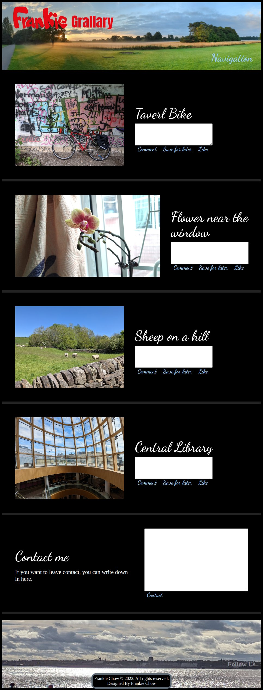

# frankieGrallary

you can access my website at [https://ftloksy.github.io/frankieGrallary/](https://ftloksy.github.io/frankieGrallary/) .

# Frankie Gallery

This is  Frankie's gallery. It will show four photos. You can like it, add a comment to it.
Add a simple info to me. ( Of course, this needs to add server side support to complete all functions. It's just a client part.

# Table of folder

This project uses many files and folders to cut off all components and modules to files.
Administers can follow this logic to modify the website and develop it or create new components for it.

## folders.

- CSS is a website's style folder. It is compiled from the SCSS folder’s contents.
- Fonts define website’s using fonts.
- Images are storage website’s using images.
- includeHtml is a storage website’s html parts. You can cut every 
 to here if you want.
- Script.js is stored in the script folder.
- Scss is defined at more different files, they are stored in the scss folder. They follow includeHtml’s parts.
- Svg is a storage folder, its storage website’s icon and logo. Svg tag is easy to append to html and do a good css control.

# Installation

You can download it all in a web server's folder. And use firefox or chrome to access index.html’s url. Then you can browse this.

